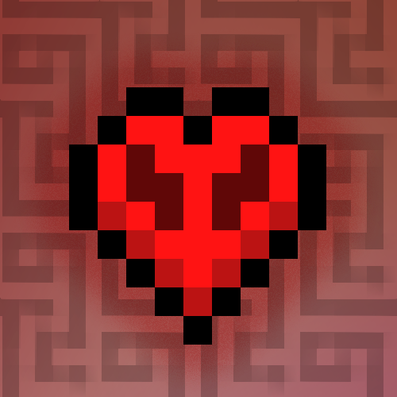

# Lifesteal Utils

**Utilities, QoL and timers for the Lifesteal Network**  
_Not maintained by the Lifesteal Network!_

   ![Mod Loader](https://img.shields.io/badge/Mod_Loader-Fabric-beige?style=flat&logo=data:image/svg%2bxml;base64,PHN2ZyB4bWxucz0iaHR0cDovL3d3dy53My5vcmcvMjAwMC9zdmciIHdpZHRoPSIxNiIgaGVpZ2h0PSIxNiIgdmlld0JveD0iMCAwIDE2IDE2Ij48cGF0aCBmaWxsPSIjMzgzNDJhIiBkPSJNOSAxaDF2MWgxdjFoMXYxaDF2MWgxdjFoMXYyaC0xdjFoLTJ2MWgtMXYxaC0xdjFIOXYySDh2MUg2di0xSDV2LTFINHYtMUgzdi0xSDJWOWgxVjhoMVY3aDFWNmgxVjVoMVY0aDFWMmgxeiIvPjxwYXRoIGZpbGw9IiNkYmQwYjQiIGQ9Ik00IDlWOGgxVjdoMVY2aDFsMS0xVjRoMVYyaDF2MWgxdjFoMXYxaDF2MWwtMSAxLTIgMy0zIDMtMy0zeiIvPjxwYXRoIGZpbGw9IiNiY2IyOWMiIGQ9Ik05IDNoMXYxaDF2MWgxdjFoMXYxaC0xTDkgNHpNMTAgMTBoMVY5aDFWN2gtMXYxaC0xekg4djJoMXYtMWgxek04IDEySDd2MWgxeiIvPjxwYXRoIGZpbGw9IiNjNmJjYTUiIGQ9Ik03IDVoMXYyaDN2MUg5VjZIN3pNNiA4aDF2MmgyVjlINnoiLz48cGF0aCBmaWxsPSIjYWVhNjk0IiBkPSJNMyA5djFsMyAzaDF2LTFINnYtMUg1di0xSDRWOXoiLz48cGF0aCBmaWxsPSIjOWE5MjdlIiBkPSJNMyAxMHYxaDJ2MmgydjFINnYtMkg0di0yeiIvPjxwYXRoIGZpbGw9IiM4MDdhNmQiIGQ9Ik0xMyA3aDF2MWgtMXoiLz48cGF0aCBmaWxsPSIjMzgzNDJhIiBkPSJNOSA0djFoMnYyaDFWNmgtMlY0eiIvPjwvc3ZnPgo=&label=Mod%20Loader&labelColor=black)

---

## Highlighted features

<strong>View highlighted features</strong>

### Alliances
**Add people as allies, have their nametags be highlighted in a different color!**

### Timers
**Track custom enchant timers on a customizable HUD**

### Customize Everything
**Tailor the chat. Remove aspects you're not interested in.**

### Hub Auto-Join
**Automatically transport from the hub to the server on join.**

### Rare Item Highlights
**Highlight rare items on the ground.**

## Maintainer

Hi! I, **Candycup**, am the core maintainer of LSU. If you think you remember me from somewhere, I was long-time staff, current Discord systems dev, and previously one of the managers of Lifesteal Network.

Regardless of my involvement with the server, this mod is **not officially endorsed, supported, or maintained** by the Lifesteal Network team. It’s an independent effort to provide a cleaner gameplay experience so more people can enjoy the server to the extent that they want to.

## Special Thanks
* **@actuallymilk** for supporting early development
* **Jonnite** for code contributions
